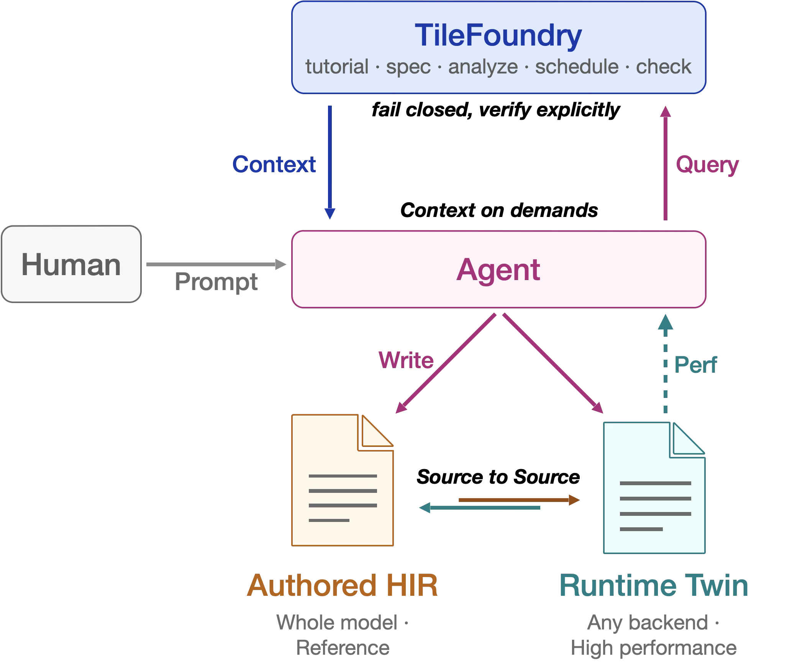

# AI Compiler in the Agentic Era

当使用者变成 agent，AI compiler 该如何演进？
{ .tf-subtitle }

## 设计 agent 与 AI compiler 之间的功能边界 { #who }

LLM 的训练与推理是一类 high-level 并行计算任务。要让一个 LLM 在特定硬件上高效运行，往往需要为特定场景定制高性能 kernel。AI compiler 正是为解决这一问题而设计的代码生成系统，也是过去几年系统研究领域最受关注的方向之一。它由一系列错综复杂、互相关联的设计选择构成，通常包括：（1）描述 LLM 算法的 DSL，以及辅助程序分析、代码变换的各层 IR；（2）如何离散化性能空间、对性能进行建模；（3）给定求得的解，如何进行代码生成。后两项——对性能建模并求解 schedule，以及给定求得的解生成代码——一直是 AI compiler 研究关注的重点。

为一个新的硬件写出高性能 kernel，调优的选择呈爆炸式增长：调整资源的分配、改变 tile 形状、重排数据的划分、重排 barrier、改变数值精度；换一个硬件、换一个模型，所有的性能选择都需要重新求解一次。这组选择通常被称为一次 scheduling。对它建模并求解是第一个难题：AI compiler 通常把性能调优转化为一个组合优化问题，在离散的性能空间中选择一组策略，而这类问题的目标与约束难以设计，解析解难以求解。生成代码是第二个难题：即便已经拥有一个分析能力足够强的 scheduler，能够判断和评估各种调度策略，把它们完备地转换为硬件上可以运行的代码、覆盖各种 corner case，这一步的工程工作量依然不容忽视。

现代 compiler 中分量最重的部分是 code optimizations，即在语义不变的前提下把程序从 A 变换到 B，使 B 在某个给定的独立指标上优于 A。为求解上述两个难题，AI compiler 在程序分析、形式化验证与性能建模上发展出了完整的设计、关键技术与配套工具：以量化的方法研究 kernel 性能，以围绕类型的形式化方法推断和验证程序语义。这些定量、形式化的方法，是 compiler 在研究 scheduling 求解与代码生成的过程中形成的最丰富的知识。

与之相对，coding agent 展现出的代码理解与代码生成能力，为这两个难题提供了另一种解法。性能建模的解析解虽然难求，但候选策略可以枚举、优劣可以实测，于是它能通过“先搜索再判定”的方式，转化为一个纯粹的计算问题——用算力和执行效率代替解析求解。而算力与执行力恰是 coding agent 最充裕的资源。GPT 模型在训练过程中见过这个世界上几乎所有能被写下来的知识，coding agent 的出现让代码生成变得极易获得；具备调用工具的能力之后，agent 还能从环境获得客观反馈，据此推断下一步的行动方向。假设算力无限，agent 的执行力足以将一个 kernel 性能空间中所有排列组合逐一生成，再通过实测筛选出性能更优的实现。

知识、经验和执行力似乎都不再是问题。困扰 AI compiler 研究多年的高性能 kernel 自动生成，是否已经被 coding agent 解决？在 agentic 时代，这两个最擅长写程序的系统之间的边界在哪里：**agent 本身成为 AI compiler，还是充当其内部的 pass、求解器或 code generator，抑或两者协同演化？**

### 反馈决定 agent 能走多远 { #hard }

kernel 优化是一条很长的决策路径，kernel 越复杂，需要的优化步骤越多。在这样一条路径上，agent 会发散、会漂移。Agent 每走一步之前，都会先用自然语言把推理过程写出来，这串推理就是它的思维链；路径一长，思维链里就会出现大量幻觉。许多研究把这归结为记忆问题，因而为 agent 系统设计复杂的记忆机制。但大量实验让我们得到另一个判断：<mark class="tf-hl">agent 非常善于在一个给定的并行方案附近调整参数，效率远高于人类专家，但它并不懂得如何优化 kernel。真正起作用的是给它什么样的反馈</mark>——沿着反馈指出的方向，agent 才能用算力把性能参数精调下去。这与它的工作方式有关：coding agent 是通过强化学习训练出的生成模型，<mark class="tf-hl">GPT 的工作方式天生带有对话与互动的性质，对反馈中的锚点高度敏感。</mark>下面我们通过一个实验分析 agent 写 kernel 的工作过程，来说明这一观察。

FlashAttention 系列算法是大算子融合的一个典型代表：它的 scheduling 方案充分考虑了硬件的内存层级，联合优化分块与融合，让中间结果一直驻留在更高的内存层级，直到必须换出为止。而从 Flash Attention 2（下称 FA2）到 Flash Attention 3（下称 FA3），又加上了对硬件异步计算单元的利用——通过 pipeline 优化，让 tensor core 尽量不空闲。这类优化给许多基于 graph 表示做分析的 AI compiler 带来了挑战。

实验让 agent 从 FA2 的方案出发，在一张 H200 上用 TileLang 追平 FlashInfer 里 FA3 的 Grouped Query Attention prefill kernel（`q[2,512,32,128] / kv[2,4096,8,128]`、fp16、causal）。过程中 agent 可以调用任何工具在真实环境中实测，但只允许修改 TileLang 一侧的代码。

我们反复观察到三个高频问题，会把 agent 困在某个性能瓶颈上：

1. **局部贪心并不等于全局最优，agent 无法走完结构改写这条优化路径。** 我们从一个性能不差的起点开始：先让 agent 写对 FA2 的 scheduling 方案，经过一轮精细的调参，agent 很快就能写出性能与 FlashInfer 相当的 kernel。但要从 FA2 的实现出发达到 FA3 的性能，必须改变程序结构——warp 分成生产者与消费者、拷贝交给异步单元、softmax 与矩阵乘在不同 warpgroup 上交错、ring buffer 分级。如果我们把这条优化路径拆成 agent 能逐步执行的改动，每一步单独测试，性能都有可能低于起始点的 kernel，最差的一步可以慢到三倍。以实测为唯一反馈，这些改动全都该回滚；实际结局正是如此：几种 warp specialization 变体全部 regression，agent 退回 FA2。

    > 要让 FA3 结构最终快过 FlashInfer，五个改动必须一次性完成：孤立评估其中任何一个，测出来都可能是零收益甚至负收益。在从 FA2 到 FA3 的优化路径中，涉及异步计算流程的改写，需要等到寄存器预算一起调整之后，性能收益才会转为正；在我们的实验中，中间状态最差的情况下会比起点的 kernel 慢三倍。这样一条优化路径，如果只靠实测反馈，agent 无法走完。

2. **实测的反馈是一个数值，不含归因，agent 只能通过思维链推测慢在哪里，并把错误的推测当成结论。** 当只有耗时可以作为反馈时，agent 给出的结论是「`<= 167 µs` is **PROVABLY impossible** in TileLang」。我们又让 agent 直接去读一份参考源码——这已经是一种作弊行为，相当于诱导 agent 照抄现有代码——agent 很快把性能差距缩小到 4%，随后又用指令数论证，剩下的这 4% 来自编译器后端的指令调度，改 kernel 已经解决不了。

    > 当我们人工引导 agent 把反馈换成逐指令的 stall 归因，并对参照实现做同样的 profiling 逐条对比，被 agent 判定为无法再缩小的那 4% 性能差距，可以立刻被拆分为三条可以定位的性能问题：生产者用了四个 warp，而这四个 warp 全都在自旋（占 stall 采样的 27%，对比实现为 0）；等待矩阵乘结果产生了一段很长的空闲窗口期（292 对 122 个采样点）；输出不经过 shared memory 直接写回显存（115 对 0）。对这三条差异依次进行修改，性能从比 FlashInfer 慢 4% 变成快 3%。

    实测得到的耗时只能说明改完之后变快还是变慢，不能说明时间花在哪里。Agent 得不到下一步的优化思路，只能把自己的推测当成结论；而 agent 的推断很容易混入大量幻觉，于是优化过程变得非常漫长，甚至陷入停滞。

3. **风险不可判定，所以 agent 不敢做激进的修改。** agent 是强化学习策略训练出来的天生的 reward hacker：只要能做增量修改就不重写，在若干候选之间总是选改动最小的那一个。把 FA2 这个局部最优直接写成结论——「the **unique TileLang optimum**; all alternatives regress」——就是这个偏好的直接结果。

    > Agent 的行为偏好来自训练数据。我们观察到，在许多写程序的任务上，agent 会优先选择增量修改，而不是大幅重写；训练 agent 的 reward 函数会驱使它判断大幅重写更容易出错，于是 agent 总是沿着最短的那条路径朝目标收敛。如果一个激进改动的风险不可判定，实测又分辨不出这次改动有没有带来新的优化方向，agent 就会倾向于不做改动。

通过高度的人工干预纠正优化方向，我们让 agent 找到了从 FA2 到 FA3 的 scheduling 方案，性能最终超过了 FlashInfer。整个过程经历了三次大的性能瓶颈。同一个 agent、同一个 DSL、同一个编译器，它能不能跳出瓶颈、继续逼近性能上限，由它在优化过程中拿到什么反馈决定。

| agent 拿到的反馈 | 做到的性能 |
| --- | ---: |
| 端到端耗时与文档 | 比 FlashInfer 慢 12% |
| 逐处比对参照实现的源码 | 比 FlashInfer 慢 4% |
| 逐指令的 stall 归因 | **比 FlashInfer 快 3%** |

在每一次性能瓶颈上，agent 都宣布过性能已经到顶、无法继续优化，并且给出了论证充分的理由。但每换一级更细的反馈，上一级判定为拿不到的那部分收益，就又出现了可走的优化路径。

### 为什么需要 TileFoundry { #how }

我们回到文章开始的问题：在 agent 时代，AI compiler 和 coding agent 这两个最擅长写程序的系统之间的边界在哪里？

Agent 在海量数据与算力与算力的加持下，长于搜索与执行 。这驱使着许多现有的工作把 coding agent 写高性能 kernel 这个任务设计成一个循环：让 agent 调用工具从环境获得反馈，不断优化 kernel 的执行时间，避免人工干预，以此最大化 agent 带来的生产力提升。

compiler 则长于程序分析，能对程序行为做推断和验证。但传统的 AI compiler 为生成可执行代码而设计的，作为一个自包含的完整系统，其内部走完了代码变换与生成的完整链路，对程序做出的判断也只服务于内部的程序变换，没有与外界工具交互的需要。因此 agent 能从 compiler 获得的反馈，只有类型检查是否通过、编译是否通过。

另一条路是把大量文档一并给 agent，但文档只是一段更长的 prompt：当 agent 已经见过几乎所有能被写下来的知识，让它跳出优化瓶颈的关键，就不仅仅是知识本身，而是在它当前所处的这一个优化点上，下一步应该往哪里走的动态反馈。这是静态文档无法给出的信息。

## TileFoundry 的设计选择 { #principles }

基于以上这些观察，我们设计了 TileFoundry，也借由它重新思考和回答在 agent 时代，coding agent 与 AI compiler 之间的工作边界应该如何设计。

在 TileFoundry 里，开发者只用一段自然语言 prompt 描述任务目标，此后由 agent 向 TileFoundry 的 CLI 提问，再根据得到的反馈修改和生成 kernel。使用 TileFoundry 所需的全部知识由五条命令提供：

| 命令 | 它回答的问题 |
| --- | --- |
| `tutorial` | 该做什么，按什么步骤和顺序做 |
| `spec` | 有哪些规范文档，每一份文档讲什么，某一节怎么规定 |
| `analyze` | 这份程序要多少计算量、多少内存流量，roofline下限是多少，bound 性能的类型是什么，算力还是带宽, etc. |
| `schedule` | 复杂的异步流水该怎么排——出可行方案，但不证明 |
| `check` | 两份程序是否一致，对照调用方给出的判据 |

Agent 与 TileFoundry 之间交互的对象是两份程序：authored HIR 和 runtime twin。authored HIR 能够以整个模型为单位（不局限于单个 operator）描述独立于任何硬件的逻辑计算过程；而 runtime twin 服务于性能，可以由任何后端具体地实现。TileFoundry 的 `check` 严格检查这两份程序的语义是否等价。在整个工作循环里，TileFoundry 不写 kernel，它只回答 agent 的问题，读懂程序并给出这段程序的性能界，对一次优化给出判决。图 1 是这个过程的全貌。

{ .tf-fig width="600" }

*图 1　TileFoundry 使用过程中developer，agent和AI compiler的交互过程。*
{ .tf-figcap }

在[下一节](#usage) 我们会进一步介绍这些核心组件，这里我们首先聚焦于TileFoundry做出的核心设计选择：

1. **Agent 与 TileFoundry 通过两份程序 source-to-source 交互：硬件无关的 HIR，硬件相关的实现。** HIR 是硬件无关的语义参考程序，描述算什么、每个 value 驻留在哪一层内存、沿 tensor 的哪个轴切分；它可以被 evaluator 直接解释执行，也可以被静态分析，在尚无任何 kernel 实现时便算出 IO 流量、容量与 roofline 下限。runtime twin 是硬件相关的程序，指令选择、barrier、流水级数、warp 分工、拷贝是否异步、寄存器预算如何划分，都在这一层决定；TileFoundry 从不读它的函数体，只调用它。

    > 这两份程序互不生成：twin 若由 HIR 编译而来，两者便同源，编译器的错误会同时落在两边，比较只能证明编译器自洽。它们的结构必须一一对应，函数名与子模块名的集合完全相等，写下时即校验；判决的位置因此是固定的，无论 agent 将多少算子融进一个 kernel，`check` 比对的位置都不改变。

2. **上下文由 TileFoundry 按需给出。** TileFoundry 与 agent 之间通过 CLI 交互，知识不预先写进 prompt，而是由 agent 按需 query。

    > 编译器分析将优化指导、硬件规格与策略评估编码为 context，agent 在需要时发出 query，信息随之逐步披露。取回的每一句回答，都是针对 agent 手中这份程序当场算出来的，因此能引导它一步步收敛到性能极限，同时也免去了 context 膨胀的代价。

3. **默认拒绝，显式验证。** 一个会静默放行的系统，agent 只能对它的每一句回答都存疑。为了让 agent 敢于做出激进的结构修改，需要把「对不对」和「快不快」的判决分开。因此 TileFoundry 通过 `analyze` 和 `check` 分别提供了静态分析和运行时两层默认拒绝。
   
    > 静态的 `analyze`通过类型与存储位置（placement）推断，以及内存容量、IO traffic 等静态分析，拒绝不合理的修改；它不给出近似值，算不出结论也不会放行。运行时的 `check` 执行 agent 写下的实现，把每个输出与参考逐位比对；进入这一层时，不成立的结构已被静态分析拒之门外。两层都只判断语义，不看耗时，也都要求调用方显式给出判据：每个输出至少声明一个谓词，容差由调用方指定，系统不代为选择默认值，因此不会静默通过。正因为拒绝是确定的，agent 才敢于选择更大的结构变动，敢于走一段暂时变慢的路径。

## 使用 TileFoundry：DSL、check 与 analyze { #usage }

当开发者接到一个任务，优化下面这段 PyTorch 程序：

```python
def reference(x):  # x: float16[1, 4096, 2048]
    a = x * x
    b = a + x
    return b * x
```

开发者将参考程序和优化目标一起交给 agent：

> 用 TileFoundry 分析这段计算，寻找适合 H200 的切分与存储方案，并编写与参考结果一致的实现。

这对应图 1 中 Human 发出的 Prompt。接下来，由 agent 自行推进整个任务流程：

**第一步：认识工具，明确工作流。** agent 拿到 prompt，先向 TileFoundry 提问：

| agent 问什么 | 命令 |  学会什么|
| --- | --- | --- |
| 这是什么 | `tilefoundry` | 工具的能力与命令入口 |
|  该怎么做| `tilefoundry tutorial` | 典型的工作流程 |
| HIR 语法怎么写 | `tilefoundry spec dsl` | DSL 的语言规范 |

一轮探索后，agent掌握足够的信息，开始写程序，后续遇到具体问题时再按需查询。

**第二步：写出 HIR，迭代切分方案。** agent 用 DSL 描述参考中的计算。它先沿行按 8 并行，三步计算都在寄存器中完成，再写回显存：

```python
@func
def chain(x: Tensor[(1, 4096, 2048), "f16"]):
    with Mesh(("cta",), layout=(8,), names=("tile",)) as cta:
        xr = tf.reshard(x, (1, 4096 @ cta.tile, 2048), "rmem")
        a = tf.mul(xr, xr)
        b = tf.add(a, xr)
        return tf.reshard(tf.mul(b, xr), (1, 4096 @ cta.tile, 2048), "gmem")
```

其中 `Mesh` 描述执行域，`reshard` 指定数据的分布和存储位置。这样，agent 就写出了第一版 authored HIR，但是 **这份方案是否可行？**
为了确认这个事实，agent 调用 `tilefoundry analyze`，询问这份 HIR 的工作量、流量、容量和理想时间：
```sh
tilefoundry analyze hello_placed_toobig.py:Placed.chain report.txt \
    --compute-cost --memory --roofline
```
TileFoundry 返回了容量错误：每份输入有 `512 × 2048` 个 fp16 元素，需要 2 MiB，超过 H200 target 声明的 256 KiB rmem 容量：

```text
needs 2097152 B in rmem, which exceeds the 262144 B the target states for that level
```

这条反馈成为下一次修改的依据。agent 再沿列切 32 份，形成 `8 × 32 = 256` 个 CTA 分片。每个 CTA 内安排 `32 × 8` 个线程，让每个线程持有连续 8 个 fp16，供实现时向量化读写。模块同时声明 256 个 CTA 和每 CTA 256 个线程，输入和算术保持不变：
```python
with Mesh(("cta",), layout=(8, 32), names=("row", "col")) as cta:
    with Mesh(("thread",), layout=(32, 8), names=("row", "col")) as thread:
        xr = tf.reshard(x, (1, 8 @ cta.row, 16, 32 @ thread.row,
                            32 @ cta.col, 8 @ thread.col, 8), "rmem")
        a = tf.mul(xr, xr)
        b = tf.add(a, xr)
        return tf.reshard(tf.mul(b, xr),
                         (1, 8 @ cta.row, 16, 32 @ thread.row,
                             32 @ cta.col, 8 @ thread.col, 8), "gmem")
```
对修改后的 HIR 再运行同一组分析，每份输入降为 64 KiB，报告的 rmem 峰值为 192 KiB，容量检查通过。agent 随即调用 `check`，执行这份 HIR 并与 PyTorch 参考结果比较：

```sh
tilefoundry check hello_two_cuts.py:Placed.chain \
    --inputs files:x.pt --expected expected.pt --device cuda \
    --out output --fn equal
```
```text
reference: expected.pt
PASS
```

**第三步：实现 runtime twin，再获得性能数据。** 有了通过检查的 HIR，agent 开始写图中的另一份程序。它采用 PyTorch 的 `load_inline` 编译 CUDA custom op，按 HIR 的分布安排 CTA 和线程。每个线程一次读写连续 8 个 fp16 (16 字节)，并用 `half2` 成对计算：

```cuda
union Half8 { uint4 packed; half2 pairs[4]; };

__global__ void chain(const half* __restrict__ input, half* __restrict__ output) {
    int c = threadIdx.x * 8;
    for (int r = threadIdx.y; r < 512; r += blockDim.y) {
        int i = (blockIdx.y * 512 + r) * 2048 + blockIdx.x * 64 + c;
        Half8 values{*reinterpret_cast<const uint4*>(input + i)};
        #pragma unroll
        for (int j = 0; j < 4; ++j) {
            half2 x = values.pairs[j];
            half2 a = __hmul2(x, x);
            half2 b = __hadd2(a, x);
            values.pairs[j] = __hmul2(b, x);
        }
        *reinterpret_cast<uint4*>(output + i) = values.packed;
    }
}

// 启动配置：grid.x 切列，grid.y 切行；stream 为 PyTorch 当前 CUDA stream。
chain<<<dim3(32, 8), dim3(8, 32), 0, stream>>>(input, output);
```
HIR 的类型系统提供连续数据在线程间分布的描述，CUDA 实现负责选用向量访存指令。通过反汇编已确认这里生成了 128-bit load/store；每个线程每轮只保留 8 个值。

通过 `@runtime_module(Placed)` 关联 HIR，并实现同名的 `chain`：
```python
@runtime_module(Placed)
class InlineTwin:
    @runtime_func
    def chain(self, x):
        return torch.ops.tf_blog_hello.chain(x)
```

agent 再次调用 `check`。这次选择 twin，并省去 `--expected`，TileFoundry 就会执行对应的 HIR 作为参考：

```sh
tilefoundry check hello_twin_cuda.py:InlineTwin \
    --inputs files:x.pt --device cuda --out output --fn equal
```

```text
reference: evaluator on Placed.chain
PASS
```

检查通过后，agent 再测量实际耗时。用 CUDA event 计时：先预热 10 次，再测 10 组、每组 100 次，取平均单次耗时的中位数。编译不计入时间：

```python
runtime = InlineTwin()
for name, fn in [("PyTorch reference", reference), ("CUDA twin", runtime.chain)]:
    print(name, measure(fn)["median_us"], "μs")
```

H200 上本次实测，整个调用过程中， PyTorch reference 为 **34.67 μs**，CUDA twin 为 **7.68 μs**，约 **4.51×** 加速。

Agent 直到最后一步才实测拿到 Perf 反馈，作为下一轮优化的事实。 再次之前，`check` 检查结果是否符合判据，`analyze` 提供静态代价分析，帮助Agent 规避错误方向，高效且精准地完成优化任务。

## 把 TileFoundry 交给 agent：写出整个模型 { #whole-model }

## 展望 { #outlook }
